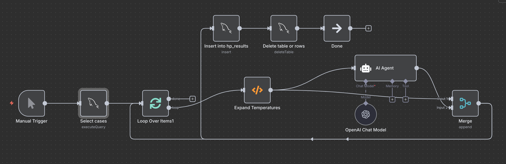

# ⚙️ Automation Workflow — Dynamic Inference Pipeline (n8n)

This section documents the **n8n automation workflow** (`automation_workflow.json`) developed for hyperparameter optimization.  
The workflow automates the process of selecting cases, running multiple LLM assessments at different inference settings, and storing all outputs in the SQL database.

---

## 💡 Overview

The workflow connects **database operations**, **LLM inference**, and **data storage** in one automated pipeline.  
It can be triggered manually or on a fixed schedule, and it executes the following main steps:

1. **Select predefined cases** from the MySQL database  
2. **Iterate over multiple inference temperatures**  
3. **Run the AI agent (Naranjo causality assessment)**  
4. **Store each result and its corresponding hyperparameters**  
5. **Clean up or remove empty outputs**

---

## 🧩 Main Components

| Node | Type | Description |
|------|------|-------------|
| **Manual Trigger** | `n8n-nodes-base.manualTrigger` | Allows manual execution of the workflow during testing. |
| **Schedule Trigger** | `n8n-nodes-base.scheduleTrigger` | Enables periodic execution (e.g., weekly runs for new data). |
| **Select cases** | `n8n-nodes-base.mySql` | Executes an SQL query to pull specific `case_id`, `drug`, and `event` combinations from the `icsr_assessment_import` table. |
| **Loop Over Items** | `n8n-nodes-base.splitInBatches` | Splits the selected cases into manageable batches for parallel processing. |
| **Expand Temperatures** | `n8n-nodes-base.function` | Duplicates each case into multiple versions, each assigned a different **temperature** (e.g., 0.1, 0.3, 0.7, 1.0). Other hyperparameters like `frequency_penalty` and `max_new_tokens` remain constant. |
| **AI Agent** | `@n8n/n8n-nodes-langchain.agent` | Uses a chain-of-thought LLM prompt to perform the **Naranjo Algorithm causality assessment** for each case. |
| **OpenAI Chat Model** | `@n8n/n8n-nodes-langchain.lmChatOpenAi` | Runs the GPT-4 model (e.g., `gpt-4.1-mini`) with dynamic inference hyperparameters received from the “Expand Temperatures” node. |
| **Merge** | `n8n-nodes-base.merge` | Combines results from the AI Agent and the expanded case data before storage. |
| **Insert into hp_results** | `n8n-nodes-base.mySql` | Inserts model outputs, together with their corresponding hyperparameters, into the SQL table `hp_results`. |
| **Delete table or rows** | `n8n-nodes-base.mySql` | Removes entries with empty `llm_output` values to maintain clean datasets. |
| **Done** | `n8n-nodes-base.noOp` | Marks the end of the workflow execution. |

---

## 🔁 Execution Flow

1️⃣ **Triggering**  
   - Can be launched **manually** for testing or automatically via the **Schedule Trigger** for weekly runs.  

2️⃣ **Case Selection**  
   - Retrieves a predefined set of `case_id`s from the MySQL table `icsr_assessment_import`.  
   - The query can be edited to include new or random cases.

3️⃣ **Hyperparameter Expansion**  
   - The Function node `Expand Temperatures` duplicates each case for different inference temperatures.  
   - Example: 10 cases × 4 temperatures = 40 model runs.

4️⃣ **Model Inference**  
   - Each case-temperature pair is passed to the **AI Agent**, which sends the prompt to **OpenAI GPT-4.1-mini**.  
   - The model is instructed to perform a **Naranjo causality assessment**, using the structured format developed in previous steps.

5️⃣ **Result Storage**  
   - Outputs (answers, rationales, and scores) are inserted into the **`hp_results`** table, along with the tested hyperparameters.  
   - This table is later used for performance tracking and Bayesian optimization experiments.

6️⃣ **Cleanup**  
   - Any rows with empty model outputs are deleted automatically.

7️⃣ **Completion**  
   - The workflow finishes cleanly with the “Done” node.

---

## 🧱 Output Table — `hp_results`

| Column | Description |
|---------|-------------|
| `case_id` | Case identifier from the main ICSR table |
| `drug` | Suspected drug name |
| `event` | Reported adverse event |
| `temperature` | LLM inference temperature |
| `frequency_penalty` | Frequency penalty used |
| `max_new_tokens` | Max token limit per response |
| `llm_output` | Raw model output (JSON structure with assessment) |

---

## 🧩 Integration with the Project

- The workflow uses the **same database** as the CRUD interface and SQL notebooks (`db_icsr_assessment_manuela`).  
- It feeds the **hyperparameter optimization** and **model degradation analysis** sections of the project by continuously producing new inference results under different parameter configurations.
