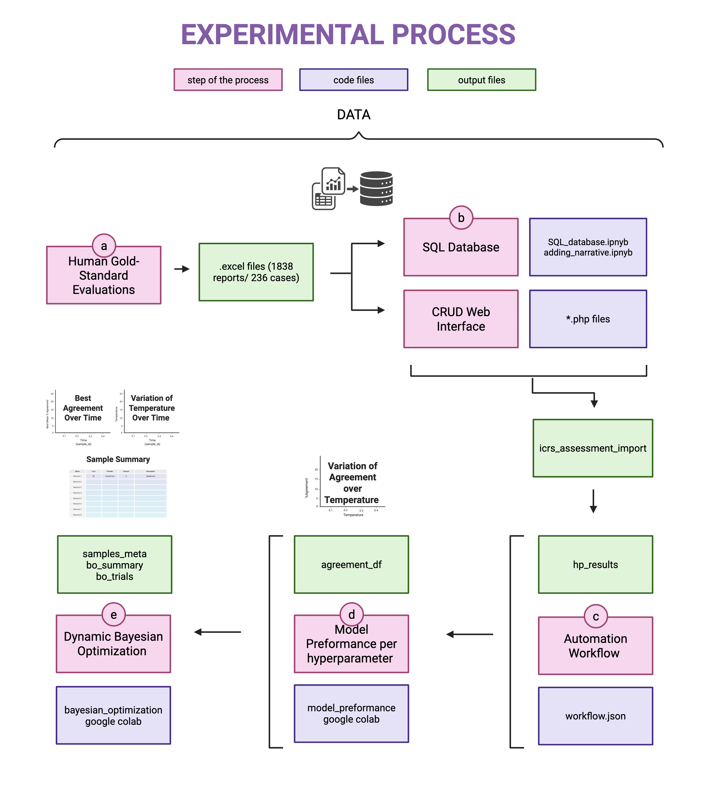

# 🚀 Dynamic_Hyperparameter_Optimization_LLM

Code and resources for **dynamic hyperparameter optimization** of Large Language Models (LLMs) applied to **causality assessment** in pharmacovigilance.  
This project explores how **inference hyperparameters** affect performance and stability over time, addressing **concept drift** and **model degradation** through automated workflows orchestrated in **n8n**.

---

## 🧭 Workflow Overview

The following is an overview of the experimental process:

---

## 🎯 Research Questions

This experimental setup aims to answer the following key research questions:

**RQ1 – Data Infrastructure**  
How can pharmacovigilance data be efficiently organized, stored, and accessed to support dynamic automation of LLM-based causality assessments?

**RQ2 – Automation Framework**  
How can an automated workflow be designed to continuously evaluate, optimize, and store results from LLM assessments of ICSRs from databases?

**RQ3 – Hyperparameters**  
Does changing inference hyperparameters (e.g., temperature, top-p, top-k, etc.) significantly affect the percentage agreement between LLMs and human experts?  
If so, which hyperparameters—or combinations—lead to the most optimal performance for causality assessment tasks?

**RQ4 – Dynamic Adaptation and Model Degradation**  
How can we monitor performance degradation of LLMs over time and apply dynamic hyperparameter optimization to improve or maintain model stability as data distributions evolve?

---

## 🧩 Description of Each Step

### **(a) Human Gold-Standard Evaluations**
This step represents the reference dataset of manually validated causality assessments (around **1,838 reports / 236 FAERS cases**).  
These serve as the **gold standard** for evaluating model agreement and performance.  
**Research question addressed:** RQ3  

---

### **(b) SQL Database and CRUD Web Interface**
All data and narratives are structured in a **SQL database** and made accessible through a **CRUD interface**.  
This setup ensures that information can be easily queried, updated, and integrated into automated workflows.  
**Research question addressed:** RQ1  

---

### **(c) Automation Workflow (n8n)**
The workflow automates **LLM causality assessments** by iterating across multiple hyperparameter settings (e.g., temperature) and storing all results in the SQL database.  
This allows **scalable and reproducible** experimentation with different inference configurations.  
**Research question addressed:** RQ2  

---

### **(d) Model Degradation per Hyperparameter (Temperature)**
Instead of performing a full Bayesian optimization, this step performs a **lookup-based re-evaluation** of the hyperparameter combinations previously tested in the automation workflow.  
It compares how performance changes across different datasets or time points to assess whether **model stability** is maintained even as data distributions and temperature values vary.  
This step also examines which temperature settings yield the best performance for each dataset, helping to identify **shifts in optimal configurations over time**.  
**Research question addressed:** RQ4  

---

## 📁 Repository Structure

Each folder corresponds to a major step in the workflow.  
Steps (a) and (b) are grouped together since both deal with data management and setup.

| Folder | Step | Description | Example Files |
|:--|:--:|:--|:--|
| **01_Data_Import_and_Database** | (a)+(b) | Scripts for importing ICSR data, cleaning narratives, and loading them into the SQL database. Includes code for table creation and CRUD setup. | `create_tables.sql`, `import_narratives.py`, `update_main_table.py` |
| **02_Automation_Workflow** | (c) | Contains the **n8n workflow** and related scripts to run LLM causality assessments across multiple hyperparameter configurations. Automatically stores outputs in SQL tables. | `workflow_n8n.json`, `llm_assessment.py`, `store_results.py` |
| **03_Model_Degradation_Analysis** | (d) | Scripts for analyzing how performance varies with each hyperparameter and over time. Produces visualizations and summary statistics to detect model drift. | `plot_agreement_vs_temp.py`, `model_drift_analysis.ipynb` |
| **04_Dynamic_Hyperparameter_Evaluation** | (d) | Lookup-based re-evaluation of previously tested hyperparameter combinations across datasets/time points. Identifies changes in optimal temperature and stability. | `dynamic_lookup_BO.py`, `compare_timepoints.py` |

---

## 📊 Outputs

The main outputs (green boxes in the workflow diagram) include:

| Output | Description |
|:--|:--|
| **icsr_assessment_import** | SQL table containing imported ICSR data, including information about report, human gold-standard evaluations and narratives. |
| **hp_results** | Table storing information about report (case_id, drug, event), inference hyperparameter configurations and LLM output. |
| **plots/** | Visualizations such as temperature vs. agreement or degradation trends. |
| **Tables/** | From Bayesian_Optimization.ipnyb summaries comparing models, datasets, and time points. |

---

## ⚙️ Environment & Reproducibility

- **Python:** 3.10+  
- **Key Libraries:** `pandas`, `sqlalchemy`, `matplotlib`, `skopt`, `openai`, `llama_cpp`  
- **Database:** MySQL (via `mysql-connector` or `sqlalchemy`)  and .php files for CRUD web interface. 
- **Automation:** n8n (self-hosted or via ngrok)  

Each folder contains a short README with more detailed explanations of its scripts and outputs.

---

✨ *Developed as part of the Bioinformatics Project at the Drug Safety Group, Department of Drug Design and Pharmacology at the University of Copenhagen.*  
*Authors: Maurizio Sessa and Manuela Del Castillo* 🧠

Each folder includes a short README explaining how to run the scripts and what each output represents.
